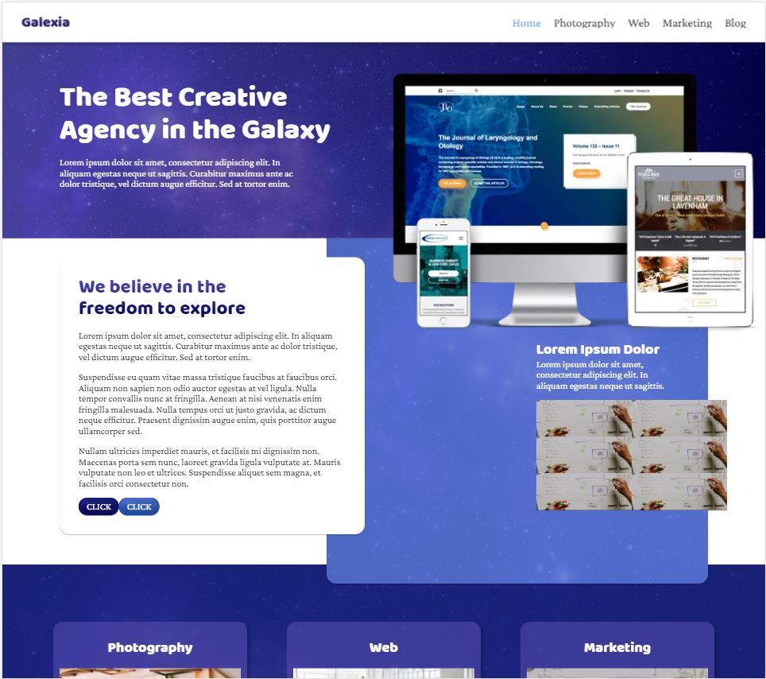
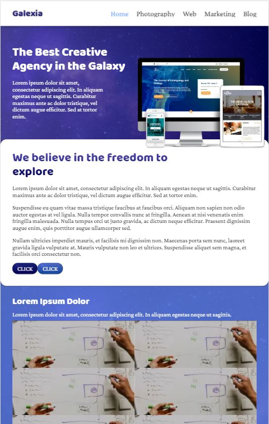

<h1 align="center">Welcome to the Galexia site repo</h1>
<p align="center">Galexia is a digital design agency providing Web, Marketing, and Photography services to small businesses.</p>
<p align="center"><a href="https://galexia.agency">Live Site</a> <a href="https://github.com/joebailey26/Galexia">GitHub Repo</a></p>
<p align="center">
  
  <a href="https://twitter.com/joebaileyphoto" target="_blank">
    
  </a>
  <a href="https://app.netlify.com/sites/confident-mcclintock-f9c36a/deploys">
    
  </a>
</p>

## Install

```sh
yarn install
```

## Development

```sh
yarn start
```

## Build

```sh
yarn build
```

## Visual Style Guide


## Coding Style Guide

### HTML

#### HTML5 Doctype

```sh
<!DOCTYPE html>
```

#### HTML Lang Attribute

```sh
<html lang=”en-GB”>
```

#### Syntax

HTML will be indented consistently by a tab character or 4 spaces.
Nested elements will be indented once.
Self closing elements need a trailing slash such as the `````` element

#### Attributes

Attributes and elements should always be lowercase
Double quotes should always be used, never single

##### Attribute Order

HTML attributes should come in this particular order for easier reading of code.
```id```
```class```
```data-*```
```for | type | href | src```

#### HTML5 Tags

HTML5 tags such as ```<header>```, ```<footer>```, ```<nav>```, and ```<time>``` are preferred over standard ```<div>``` tags.

### SCSS

CSS Files are not needed as Node Sass compiles the SCSS.

SCSS should be included in a CSS folder in the same directory as the component/element

Use one tab to indent each property

Add one blank line between code blocks

Multiple selectors can be on one line and must end with a curly brace

Property-balue pairs should be on their own line with one tab of indentation and ending in a semicolon

The closing brace should be flush left using the same amount of indentation as the opening selector

Colors should use names where possible rather than hex values

```sh
.Foo, #Bar {
  background: white;
  color: black
}

#Bar {
  width: 100%;
  height: auto;
}
```

## Git

### Commit Messages

1. Specify the type of commit:

  * feat: The new feature you're adding to a particular application

  * fix: A bug fix

  * style: Feature and updates related to styling

  * refactor: Refactoring a specific section of the codebase

  * test: Everything related to testing

  * docs: Everything related to documentation

  * chore: Regular code maintenance.

2. Separate the subject from the body with a blank line

3. Your commit message should not contain any whitespace errors

4. Remove unnecessary punctuation marks

5. Do not end the subject line with a period

6. Capitalize the subject line and each paragraph

7. Use the body to explain what changes you have made and why you made them.

8. Do not assume the reviewer understands what the original problem was, ensure you add it.

9. Do not think your code is self-explanatory

#### Command Line

```sh
git commit -m "Subject" -m "Description..."
```

#### Text Editor Template

Capitalized, short (50 chars or less) summary

More detailed explanatory text, if necessary.  Wrap it to about 72
characters or so.  In some contexts, the first line is treated as the
subject of an email and the rest of the text as the body.  The blank
line separating the summary from the body is critical (unless you omit
the body entirely).

Write your commit message in the imperative: "Fix bug" and not "Fixed bug"
or "Fixes bug."  This convention matches up with commit messages generated
by commands like git merge and git revert.

Further paragraphs come after blank lines.

- Bullet points are okay, too, use a hyphen or asterisk for the bullet, followed by a
  single space, with blank lines in between

### Branching Strategy

Master branch is for tested code and is deployed directly to **Netlify**. Do not push anything to master. Always create pull requests and test code.

Dev branch is for development work on the site. Should always contain close to production ready code requiring minimal commits to get to production status.

Branches should be created for big projects requiring more than one commit such as adding a new page. They should be titled the project name and then a pull request should be made with dev in order to test it.

## Testing

Use a local environment if possible otherwise use **Browserstack** to manually test the site by navigating to all pages and performing all actions

### List of browsers we support

* Last 2 versions of **Mozilla Firefox**
* Last 2 versions of **Microsoft Edge**
* Last 2 versions of **Google Chrome**
* Last 2 versions of **Opera**
* Last 1 versions of **Safari**
* Last 1 versions of **iOS Safari**
* Last 2 versions of **Chrome for Android**
* Last 2 versions of **Firefox for Android**
* Last 1 versions of **Samsung Internet**

## Screenshots

### Desktop



### Tablet



### Mobile


## Reflective Account

### Tooling Choices

Rather than use a traditional bootstrap style grid I have opted to use CSS Grid for the Galexia website. This involves much fewer lines of CSS and automatically scales depending on how many elements are within the grid. CSS Grid is a very new and exciting standard as it allows developers to create all sorts of layouts that couldn't be achieved before. It also speeds up development time because the specification is so simple, unlike tables and FlexBox.

I have chosen to use React to build the Galexia website. **React** is a modern JavaScript library for building user interfaces. **React** allows developers to break up their code into components which can have functions and states attached to them. The contact form on this website is a stateful component and enables users to submit the contact form and **Netlify** to process the submitted information. Functional components have been used elsewhere on the site such as for the Nav bar and the Footer. This means the codebase is much easier to maintain as updates can be appliued once and then rolled out on all pages where the component has been used.

As I have used a JAMStack approach to creating this website I have not needed to set up a server to host it. Instead, I have used Netlify, which automatically builds the website using Yarn, when I push changes to **GitHub**. JAMStack sites are fast and secure, delivered by pre-rendering files and serving them directly from a CDN, removing the requirement to manage or run web servers.

I have used Node Package Manager to maintain the dependencies in this project. One advantage of using **NPM** is that a *package.json* file is created. This file instructs any development machine which dependencies are required by the Galexia site. This comes with many advantages, including, any machine with **Node** installed can be used to develop the Galexia site, and dependencies don't have to be stored in the repo for Galexia.

Examples of packages used include:

* **Hammer.js** to handle swipe detection which then opens the navigational drawer
* **Featherlight** handles opening images in lightboxes
* **Node Sass** compiles **Sass** via ```yarn run``` rather than having to compile manually
* **RSS Parser** adds RSS feeds to the site

### Problems faced

I faced a problem implementing the contact form with **Netlify's** services. This is simple on static sites, but ones rendered with JavaScript, like this one, require a bit more work. I had to include a template of the form on the *index.html* page and include some **React** to render the form and correctly parse the data to **Netlify** for the form to be submitted.

Correctly implementing RSS Feeds on the site proved a difficult feat. External servers have different levels of responsiveness. Quick servers would respond with their RSS Feeds first meaning that they were displayed in the wrong order on the Galexia site. To get around this explicit class names were used on the RSS Feed containers ensuring the data was mapped to the correct location when the server responded.

### Future Ideas

This section can be found in the [Projects tab on GitHub](https://github.com/joebailey26/Galexia/projects/1)

### Conclusion

Throughout this project I got to experiment with many cutting edge technologies such as **React**, **CSS Grid**, and even some security features such as **SSL** and **DNSSEC**, which had not been possible on previous website builds on shared hosting. This new way of developing has certainly proved to be less time-consuming as pushing to **GitHub** automatically deploys the site. Working with **React** meant that I had to hone my JavaScript debugging skills which is always a beneficial skill to have. Some next steps for the website include adding a blog and adding real content to the site rather than *lorem ipsum* text.

Last Updated 4th January 2020

## Author

👤 **Joe Bailey**

* Website: [joebailey.xyz](joebailey.xyz)
* Twitter: [@joebaileyphoto](https://twitter.com/joebaileyphoto)
* Github: [@joebailey26](https://github.com/joebailey26)
* LinkedIn: [@joe-bailey-b68b17171](https://linkedin.com/in/joe-bailey-b68b17171)
