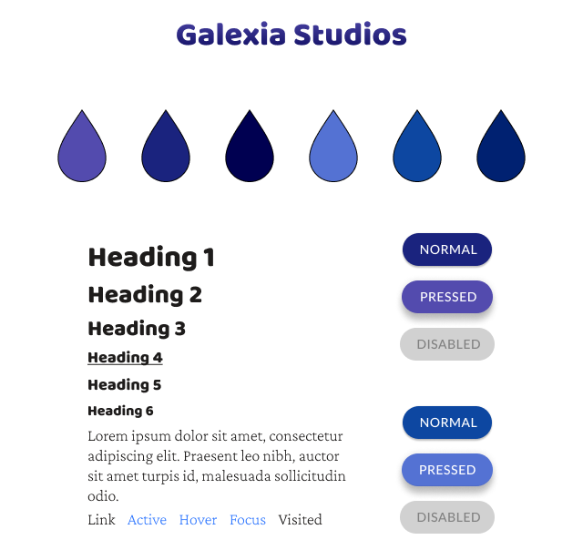

<h1 align="center">Welcome to the Galexia site repo</h1>
<p align="center">Galexia is a digital design agency providing Web, Marketing, and Photography services to small businesses.</p>
<p align="center">
  
  <a href="https://twitter.com/joebaileyphoto" target="_blank">
    
  </a>
  <a href="https://app.netlify.com/sites/confident-mcclintock-f9c36a/deploys">
    
  </a>
</p>

## Install

```sh
npm install
```

## Development

```sh
yarn start
```

## Build

```sh
yarn build
```

## Visual Style Guide



## Coding Style Guide

### HTML5 Doctype

```sh
<!DOCTYPE html>
```

### HTML Lang Attribute

```sh
<html lang=”en-gb”>
```

### Syntax

HTML will be indented consistently by a tab character or 4 spaces.
Nested elements will be indented once.
Self closing elements don’t need a trailing slash such as the `````` element

#### Attributes

Attributes and elements should always be lowercase
Double quotes should always be used, never single

##### Attribute Order

HTML attributes should come in this particular order for easier reading of code.
```id```
```class```
```data-*```
```for | type | href | src```

### HTML Comments

Comments are to be used every time a div is closed. They will be on the same line as the closing ```</div>``` tag. Example below:

```sh
<div id=”foo” class=”bar”>
…
</div> <!-- #foo .bar -->
```

### HTML5 Tags

HTML5 tags such as ```<header>``` and ```<footer>``` are preferred over standard ```<div>``` tags.

## Branching Strategy

Master branch is for tested code and is deployed directly to Netlify. Do not push anything to master. Always create pull requests and test code.

Dev branch is for development work on the site. Should always contain close to production ready code requiring minimal commits to get to production status.

Branches should be created for big projects requiring more than one commit such as adding a new page. They should be titled the project name and then a pull request should be made with dev in order to test it.

## Testing

Use a local environment if possible otherwise use browserstack to manually test the site by navigating to all pages and performing all actions

### List of browsers we support

* Last 2 versions of Mozilla Firefox
* Last 2 versions of Microsoft Edge
* Last 2 versions of Google Chrome
* Last 2 versions of Opera
* Last 1 versions of Safari
* Last 1 versions of iOS Safari
* Last 2 versions of Chrome for Android
* Last 2 versions of Firefox for Android
* Last 1 versions of Samsung Internet

## Screenshots

Coming Soon...

Screen shots of your website laying out on different viewport sizes, this can also be within a separate MD document.

## Reflective Account

### Tooling Choices

Rather than use a traditional bootstrap style grid I have opted to use CSS Grid in my website. This involves much fewer lines of CSS and automatically scales depending on how many elements are within the grid. It is also the latest standard in CSS and learning it will help my future career.

I have chosen to use React to build my website. React is a modern JavaScript framework which is a crucial tool in today's industry. It lets you do many dynamic things without the need of a server, such as create reusable components.

As I have used a JAMStack approach to creating this website I have not needed to set up a server to host it. Instead, I have used Netlify, which automatically builds the website using Yarn, when I push changes to GitHub.

I have used lots of NPM packages in this project. This has helped scale the project and enable development to be conducted on any machine, without having to transfer all the files. Examples of packages used include Hammer.js to handle swiping on mobile to open the navigational drawer, Featherlight to handle opening images in lightboxes, node sass in order to compile the sass via ```yarn run``` rather than having to do it manually, and RSS Parser for adding in RSS feeds to the site.

### Problems faced

I faced a problem implementing a form with Netlify's services. This is simple on static sites, but ones rendered with JavaScript, like this one, require a bit more work. I had to include a template of the form in the index.html page and include some React to render the form and correctly parse the data to Netlify in order for the form to be submitted.

It was incredibly difficult to get multiple RSS Feeds working on one page, as external servers respond in different times, meaning that the data from quick servers would come in first and subsequently be mapped to the wrong div on this site. I had to include specific div classes to ensure that the correct RSS Feed displayed in the correct location once it was parsed.

### Future Ideas

This section can be found in the [Projects tab on GitHub](https://github.com/joebailey26/Galexia/projects/1)

### Conclusion

In conclusion, developing the Galexia site taught me loads about modern web development, the work flow behind it, and some new frameworks. I did get stuck on a couple of bits but this just helped me hone in my debugging skills. There's a lot to do in the future in terms of technology such as add a blog, let alone add all the content in to the site.

Last Updated 30th December 2019

## Author

👤 **Joe Bailey**

* Website: [joebailey.xyz](joebailey.xyz)
* Twitter: [@joebaileyphoto](https://twitter.com/joebaileyphoto)
* Github: [@joebailey26](https://github.com/joebailey26)
* LinkedIn: [@joe-bailey-b68b17171](https://linkedin.com/in/joe-bailey-b68b17171)
